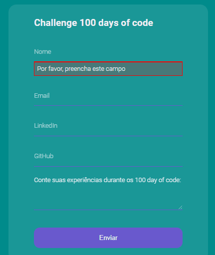

## 🍏 Formulário de validação

   

## 💬 Sobre o projeto
Criado com base nos estudos da maratona dos 100 days of code. Para construir network com outros programadores;

## 🛠 Tecnologias
- [HTML5](https://developer.mozilla.org/en-US/docs/Web/Guide/HTML/HTML5)
- [CSS3](https://developer.mozilla.org/pt-BR/docs/Learn/CSS/First_steps/O_que_e_CSS) 
- [JavaScript](https://exercism.io/my/tracks/javascript)

## 💪 Como contribuir

```
- Fork the project 
- Create a new branch with your changes:
$ git checkout -b my-feature

- Save your changes and create a commit message telling you what you did:
$ git commit -m "feature: My new feature"

- Submit your changes:
$ git push origin my-feature´

```
## 📝 Licenças

Esse projeto está sob a licença MIT. Veja o arquivo [LICENSE](LICENSE.md) para mais detalhes.


<h1 align="center">

[](https://www.linkedin.com/in/jusel%C3%A2nia-silva-56a375197/) [](https://www.instagram.com/jullydeveloper/) 
</h1>


